# Part 1: The stats.stackexchange problem  
    
----

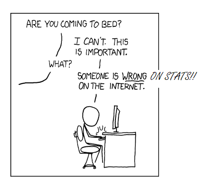

(adapted from www.xkcd.com/386)

----

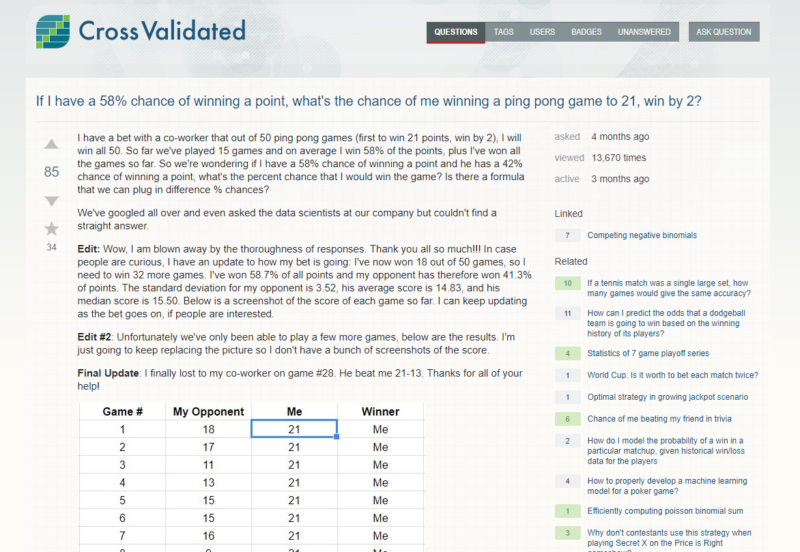

(https://stats.stackexchange.com/questions/329521)

----

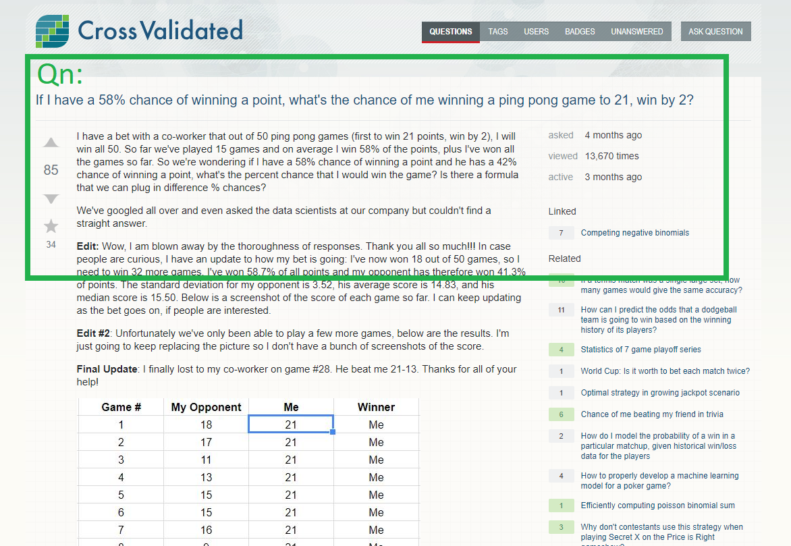

----

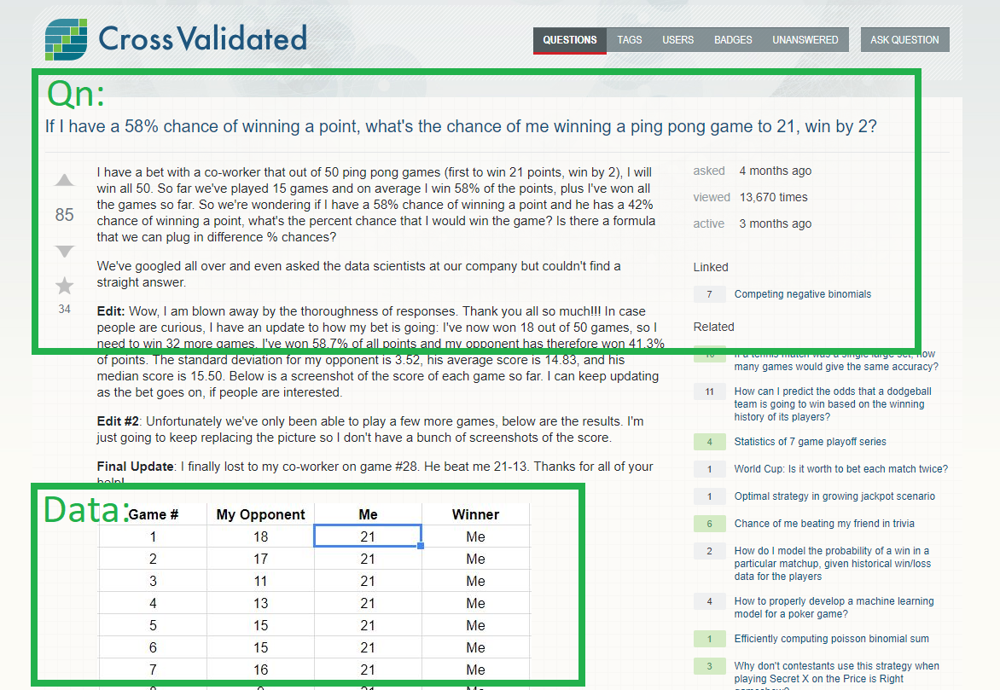
    
----

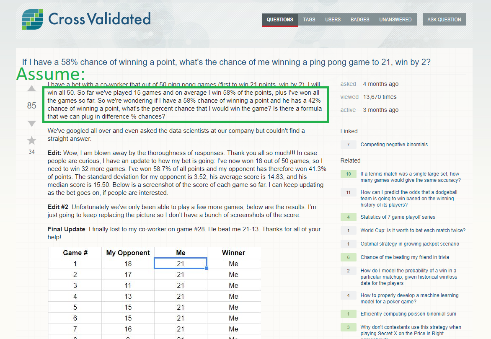

## But what if the assumption is wrong?

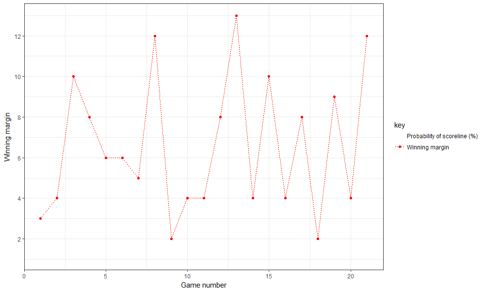

## But what if the assumption is wrong?

- Postulate that in a truly competitive game, the original poster has a much higher (than 59%) chance of winning a point

# Part 2: Why use automatic derivatives in optimisation?

## Optimisation

- Objective function (e.g. log-likelihood) and decision variables (e.g. regression coefficients).
- Gradient based vs non-gradient based (not relevant here).

## Optimisation: Newton's method

Suppose one wishes to find the value of (the decision variables) $\mathbf{x}$ such that $y = f(\mathbf{x})$ is maximised. Start with an initial guess $\mathbf{x}_0$ for the optimal values, and iteratively build better guesses $\mathbf{x}_1, \mathbf{x}_2, \dots$, via:

$$
\mathbf{x}_{n+1} = \mathbf{x}_n - \frac{f'(\mathbf{x}_n)}{f''(\mathbf{x}_n)}
$$

\pause If $\mathbf{x}$ is a vector:

$$
\mathbf{x}_{n+1} = \mathbf{x}_n - [\mathbf{H}f(\mathbf{x}_n)]^{-1} \nabla f(\mathbf{x}_n)
$$

(https://en.wikipedia.org/wiki/Newton%27s_method_in_optimization)

## Optimisation: Newton's method

Nabla is the gradient and $\mathbf{H}$ is the hessian:

$$\nabla  = \left( {\partial  \over \partial x_1}, \ldots, {\partial \over \partial x_m} \right)$$

$$\mathbf{H} = \begin{bmatrix}
  \dfrac{\partial^2 f}{\partial x_1^2} & \dfrac{\partial^2 f}{\partial x_1\,\partial x_2} & \cdots & \dfrac{\partial^2 f}{\partial x_1\,\partial x_m} \\[2.2ex]
  \dfrac{\partial^2 f}{\partial x_2\,\partial x_1} & \dfrac{\partial^2 f}{\partial x_2^2} & \cdots & \dfrac{\partial^2 f}{\partial x_2\,\partial x_m} \\[2.2ex]
  \vdots & \vdots & \ddots & \vdots \\[2.2ex]
  \dfrac{\partial^2 f}{\partial x_m\,\partial x_1} & \dfrac{\partial^2 f}{\partial x_m\,\partial x_2} & \cdots & \dfrac{\partial^2 f}{\partial x_m^2}
\end{bmatrix}$$

\pause Wow, much derivatives to find! (LaTeX from Wikipedia)

## Calculating derivatives: Analytically

- Logistic regression:
$$\log(\frac{p_i}{1 - p_i}) = \beta_0 + \beta_1 x_{i1} + \beta_2 x_{i2} + \dots $$
- \pause Log-likelihood:
$$\ell = \sum_{i=1}^n y_i \log(\frac{p_i}{1-p_i}) + \sum_{i=1}^n \log(1-p_i)$$
- \pause After some algebra (or consultation of https://stats.stackexchange.com/a/16541):
$$
\begin{split}
\frac{\partial \ell}{\partial \beta_j} &= ...\\
&= \sum_i y_i x_{ij} - \sum_i p_i x_{ij}, \\
\frac{\partial^2 \ell}{\partial \beta_j \partial \beta_k} &= \dots
\end{split}
$$
\pause (ellipses are left as an exercise for the reader.)

## How can one calculate derivatives? 

- By hand (aka analytic derivatives)
- \pause Symbolic differentiation (Mathematica, Sage, other software packages)
- \pause Numerical differentiation (computational by picking a small value for $\Delta x$):
$$f'(x) = \frac{f(x + \Delta x) - f(x)}{\Delta x}$$
- \pause Automatic differentiation

## Why automatic differentiation?

- It's magic! (since minimal additional code or thought is required to get derivatives)
- \pause Exact to machine precision.
- \pause Efficient: $\operatorname{cost}(\nabla f) \leq 4\operatorname{cost}(f)$.
- \pause https://justindomke.wordpress.com/2009/02/17/automatic-differentiation-the-most-criminally-underused-tool-in-the-potential-machine-learning-toolbox/

<!-- ## Calculating derivatives: Another example -->

<!-- 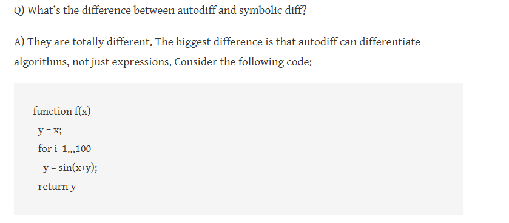 -->

# Part 3: TMB

## What is TMB

- Website for installation and tutorial: https://github.com/kaskr/adcomp/wiki
- Support: https://groups.google.com/forum/#!forum/tmb-users
\pause
- R package that calculates first and second derivatives of any objective function written in C++.
- Very, very fast $\leftrightarrow$ uses state of the art C++ packages like Eigen, CppAD, ...
- Used where more 'complex' log-likelihood functions are required. E.g.:
    - the glmmTMB package allows you to "fit linear and generalized linear mixed models with various extensions, including zero-inflation".
    - A Laplace approximation for the likelihood is implemented to deal with models containing random effects.

## Modelling: Probability to win a point 

- Let $s_i$ be the observed score difference in the $i$-th game.
- \pause Postulate that the probability of the original poster winning the $i+1$-th game is:
$$p_{i+1} = \alpha \textcolor{red}{p_0} + (1 - \alpha) \textcolor{green}{(\operatorname{expit}(\operatorname{logit}(p_i) + \beta))} $$
\pause where $\alpha$ is a 'mixing' coefficient: $$\alpha = \operatorname{expit}(\alpha_0 + \alpha_1 s_i)$$

- \pause The aim is to find values for the following parameters that maximise the likelihood of observing the game scorelines:
    - $p_0$: probability of point win when original poster is not playing at their best.
    - $\beta$: changes probability of winning in the next game depending on the scoreline this game.
    - $\alpha_0$ and $\alpha_1$: coefficients governing the averaging between $p_0$ and $p_i$.

    
## Modelling: Probability to win a game with a certain scoreline
    
- In a game, suppose player one wins points with probability $p$, and let $x$ and $y$ be the total number of points player one and two won, respectively.
    
- Suppose player one reaches 21 points first with a margin of two:
$$\Pr(21:y) = {20+y\choose y}p^{21}(1-p)^{y}$$

- \pause Else:
$$\Pr(x:y) = 2^{y - 20}{40 \choose 20}p^{x}(1-p)^{y}$$

(whuber: https://stats.stackexchange.com/a/329554)

## Code: R

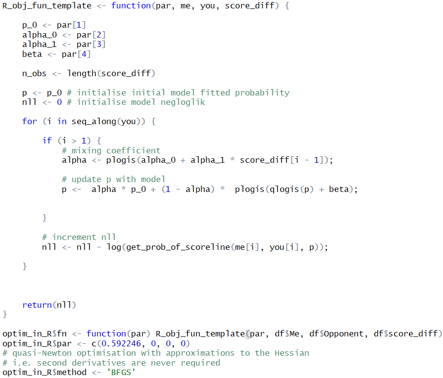

## Code: R

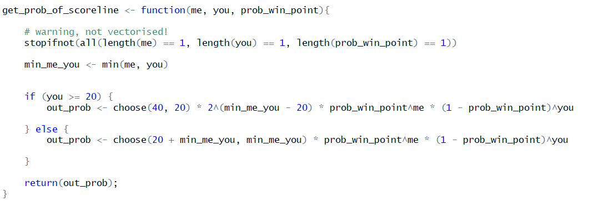

## Code: Rcpp

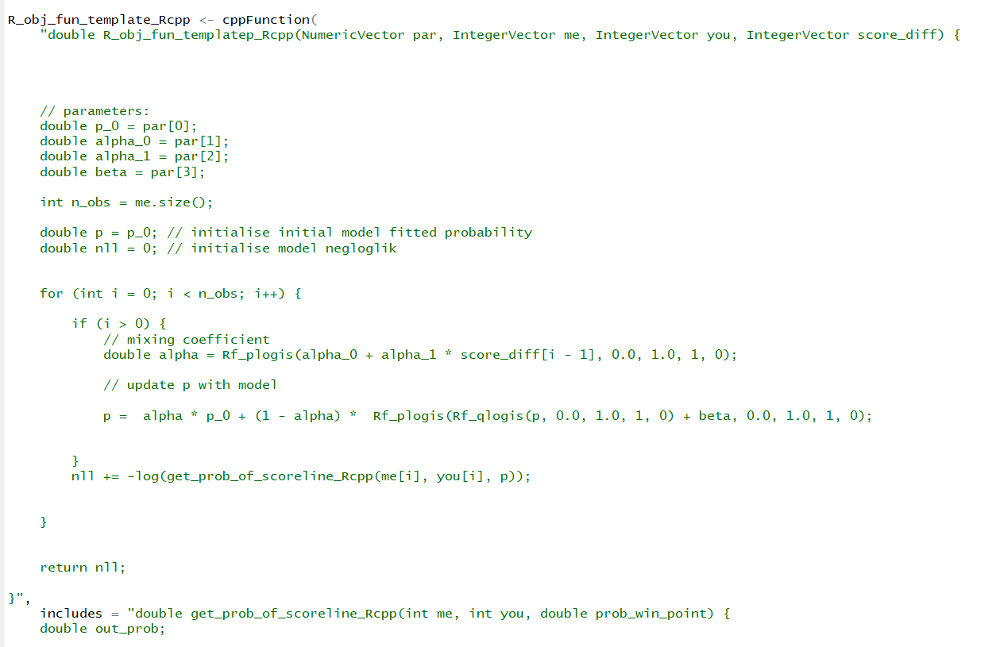

## Code: TMB

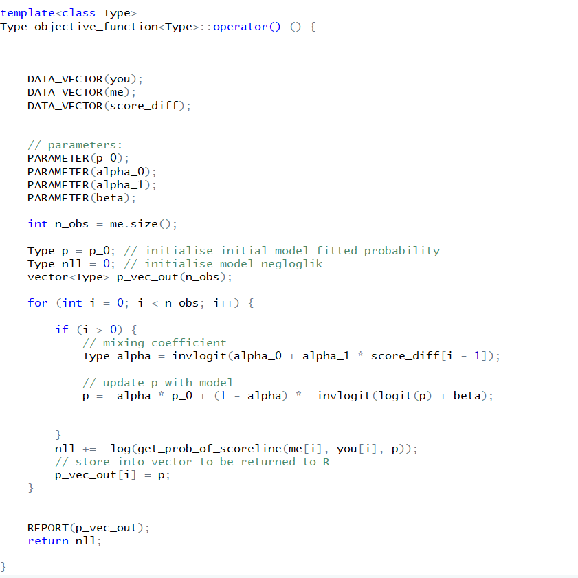

## Example usage

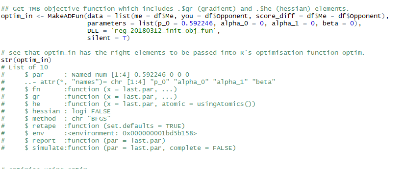

## Results: Speed of optimisation

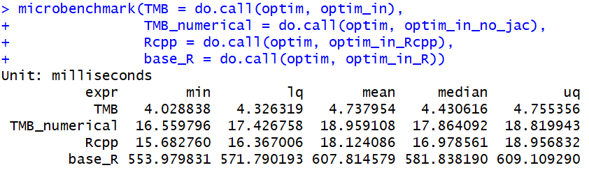

## Results: Coefficients

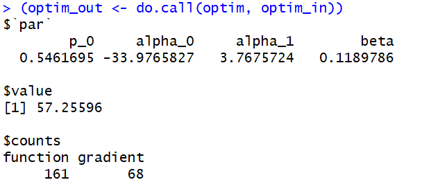

## Results: Coefficients

- Recall that $s_i$ is the observed score difference in the $i$-th game.
- The probability of the original poster winning the $i+1$-th game, given by the model, is:
$$p_{i+1} = \textcolor{red}{0.546}\alpha  + (1 - \alpha) (\operatorname{expit}(\operatorname{logit}(p_i) + \textcolor{blue}{0.119})) $$
where the mixing coefficient $\alpha$ is: 
$$\alpha = \operatorname{expit}(\textcolor{green}{-34 + 3.77s_i})$$

## Results: fitted game win probs

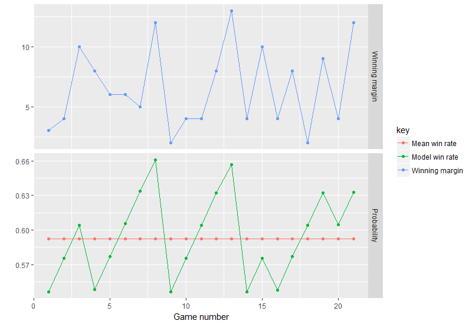

## The last word

\pause
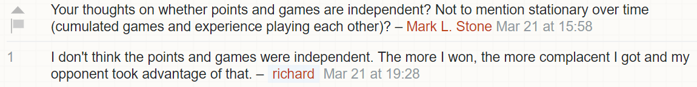

----

## Thank you

- TMB developers: Kasper Kristensen [aut, cre, cph], Hans Skaug [ctb], Arni Magnusson [ctb], Casper Berg [ctb], Anders Nielsen [ctb], Martin Maechler [ctb], Theo Michelot [ctb], Mollie Brooks [ctb], Alex Forrence [ctb], Christoffer Moesgaard Albertsen [ctb], Cole Monnahan [ctb]Thank you to user organisers + TMB developers
- useR!2018 organisers: Di Cook (Monash, chair), Rob J Hyndman (Monash), Nick Tierney (Monash), Earo Wang (Monash), Thomas Lumley (Auckland), Paul Murrell (Auckland), Bill Venables (Brisbane), Simone Blomberg (UQ), Kerrie Mengersen (QUT), Goknur Giner (WEHI), Jessie Roberts (QUT), Miles McBain (QUT), Eun-kyung Lee (EWHA, Korea), Paula Andrea (UQ), Wenjing Wang (RUC, China), Soroor Hediyehzadeh (WEHI), Rhydwyn McGuire (NSW DOH), Alex Whan (CSIRO), Steph de Silva (Rex Analytics), Anna Quaglieri (WEHI), Marie Trussart (WEHI), Kim Fitter (NZ), Monash Business School Events Team (Kerry, Hannah, Jess and Deb)
